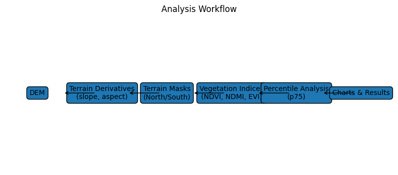
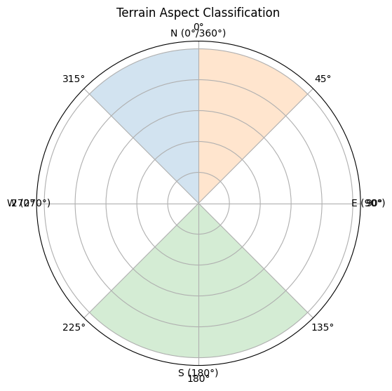

# Appalachian Terrain–Vegetation Analysis

This project analyzes vegetation patterns across terrain aspects using Sentinel-2 vegetation indices and forest composition data.

The analysis compares north- and south-facing slopes across two Appalachian study areas and tests whether vegetation productivity or moisture signals differ by terrain aspect.

---

## Contents

- [Study Areas](#study-areas)
- [Analysis Workflow](#analysis-workflow)
- [Terrain Aspect Definitions](#terrain-aspect-definitions)
- [Vegetation Indices](#vegetation-indices)
- [Temporal Analysis](#temporal-analysis)
- [Data Alignment](#data-alignment)
- [Repository Structure](#repository-structure)
- [Example Outputs](#example-outputs)

---

## Study Areas

Two Areas of Interest (AOIs) are analyzed:

- **North AOI** – George Washington National Forest region
- **South AOI** – Great Smoky Mountains region

Each AOI is processed independently using the same terrain masks and index workflows.

---

## Analysis Workflow

The workflow combines terrain analysis with time-series vegetation indices.

Steps:

1. Generate terrain derivatives from a DEM
2. Create terrain masks (north-facing, south-facing slopes)
3. Align all rasters to a common analysis grid
4. Extract vegetation indices for each terrain class
5. Compute percentile statistics
6. Compare north vs south slopes through time

---

# Terrain Aspect Definitions

Aspect represents the direction a slope faces, measured in degrees.

0° / 360° = North  
90°       = East  
180°      = South  
270°      = West  

*Terrain aspect classification used for north- and south-facing slope masks.*

### South-Facing Slopes

135° ≤ aspect ≤ 225°

Mask definition:

south_mask = (aspect >= 135) & (aspect <= 225)

### North-Facing Slopes

aspect ≥ 315° OR aspect ≤ 45°

Mask definition:

north_mask = (aspect >= 315) | (aspect <= 45)

---

### Other Terrain

Pixels not classified as north or south are treated as:

east / west / flat slopes

These are not directly compared in the primary analysis.

---

# Terrain Mask Diagram

                N
                0°
                |
        315° -------- 45°
           \           /
            \         /
             \ NORTH /
              \     /
W 270° --------     -------- 90° E
               \   /
                \ /
               SOUTH
            135°–225°

North-facing slopes:
315°–360° and 0°–45°

South-facing slopes:
135°–225°

---

# Vegetation Indices

Indices are derived from Sentinel-2 imagery.

### NDVI

NDVI = (NIR − Red) / (NIR + Red)

Measures vegetation greenness and biomass.

Typical forest values:

0.6 – 0.9

---

### NDMI

NDMI = (NIR − SWIR1) / (NIR + SWIR1)

Sensitive to vegetation moisture content.

---

### EVI

EVI = 2.5 * (NIR − Red) / (NIR + 6*Red − 7.5*Blue + 1)

Advantages:

- reduces atmospheric effects
- reduces soil influence
- avoids NDVI saturation in dense forests

---

# Temporal Analysis

For each satellite scene:

1. Index raster is loaded
2. Terrain masks are applied
3. Index values are extracted
4. The **75th percentile (p75)** is calculated

Example:

p75 NDVI for south-facing slopes

The 75th percentile is used because it:

- captures strong vegetation signals
- reduces noise from clouds or shadows
- emphasizes dominant canopy conditions.

---

# Aspect Comparison Metric

For each scene:

difference = south_p75 − north_p75

Interpretation:

difference > 0 → south-facing slopes higher index  
difference < 0 → north-facing slopes higher index  

These differences are plotted as time series.

---

# Data Alignment

All rasters are aligned to a **canonical analysis grid** before processing.

Projection: UTM Zone 17N  
EPSG:32617  
Resolution: 10 m

Alignment ensures terrain masks and index rasters correspond pixel-for-pixel.

---

# Forest Composition Data

Forest composition is derived from **FIA Forest Type Group rasters**.

Examples:

- Oak/Hickory
- Maple/Beech/Birch
- Oak/Pine
- White/Red/Jack Pine

Forest composition is used to interpret vegetation index differences between terrain aspects.

---

# Known Limitations

## Terrain Illumination Effects

Vegetation indices on sloped terrain may be influenced by **illumination geometry**.

South-facing slopes often receive more direct sunlight relative to the satellite viewing angle.

This can artificially increase vegetation index values.

Future work may include **topographic illumination correction**.

---

# Repository Structure

Project_Appalachia/
│
├── Traits/ # Terrain and forest trait processing
│ ├── build_elevation_cache.py
│ ├── prep_trait_masks.py
│ └── verify_trait_masks.py
│
├── Crosstab/ # Aspect and trait cross-tabulation analyses
│ ├── crosstab_aspect_index.py
│ ├── crosstab_aspect_ftype.py
│ ├── crosstab_aspect_fgroup.py
│ └── crosstab_ecozone_ftype.py
│
├── Charts/ # Visualization scripts
│ └── plot_aspect_results.py
│
├── Cache/ # Satellite index cache generation
│ └── build_cache.py
│
├── docs/ # Diagrams used in the README
│ ├── aspect_diagram.png
│ └── workflow_diagram.png
│
└── README.md

---

# Example Outputs

terrain_stratification_north_ndvi.png  
terrain_stratification_north_ndmi.png  
terrain_stratification_north_evi.png  

Outputs include:

- vegetation index time-series plots
- aspect difference plots
- forest composition summaries

Example figures are stored in:

results/figures/

---

# Future Work

Possible extensions include:

- topographic illumination correction
- seasonal phenology analysis
- slope filtering
- species-specific spectral analysis
- terrain moisture modeling
