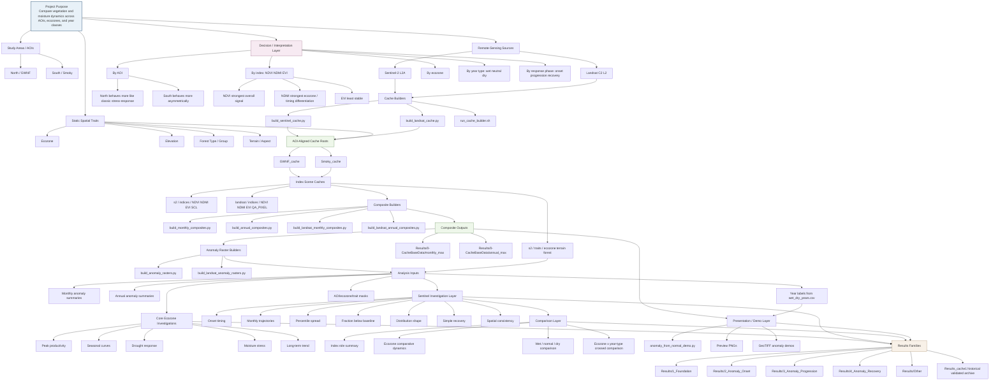

# Project Ontology

This file is a compact ontology of the Appalachian terrain-vegetation project: data sources, caches, trait layers, build steps, analysis families, outputs, and decision points.

## Flowchart

## Entity Types

| Layer | Entity | Role |
|---|---|---|
| Domain | AOI | North/GWNF and South/Smoky study regions |
| Domain | Index | NDVI, NDMI, EVI |
| Domain | Trait | Ecozone, elevation, forest, terrain/aspect |
| Domain | Year class | Wet, neutral/normal, dry |
| Domain | Response phase | Onset, progression, recovery, spatial extent |
| Source | Scene cache | Per-scene AOI-aligned rasters plus manifests |
| Derived data | Monthly composite | Per-pixel monthly max composite |
| Derived data | Annual composite | Per-pixel annual max composite |
| Derived data | Anomaly raster | Composite minus baseline or comparable anomaly form |
| Analysis | Investigation | Script family that summarizes one ecological question |
| Analysis | Comparison layer | Script family that compares indices, ecozones, or year classes |
| Output | Summary CSV | Compact tables used for interpretation and follow-on plots |
| Output | Figure | PNG summaries, heatmaps, trajectories, demos |
| Output | Historical archive | `Results_cache1`, the validated legacy deliverable set |

## Main Processes

1. Acquire scene-level remote sensing data into AOI-specific caches.
2. Align all scenes to AOI-specific canonical grids.
3. Preserve trait rasters on the same aligned grid.
4. Build monthly and annual max composites from cached scenes.
5. Derive anomaly products relative to baselines or year-class references.
6. Summarize ecozone behavior from those anomalies.
7. Compare indices, ecozones, and year classes using derived CSV outputs.
8. Produce presentation artifacts such as quicklook PNGs, heatmaps, and demo GeoTIFFs.

## Key Decisions And Rules

| Topic | Current rule |
|---|---|
| Active cache layout | Unsuffixed `GWNF_cache` and `Smoky_cache` |
| Sentinel cache retry policy | Exit immediately on any `403`; outer runner restarts |
| Landsat cache retry policy | Exit immediately on any `403`; outer runner restarts |
| Monthly composite definition | Per-pixel monthly maximum across valid scenes |
| Annual composite definition | Per-pixel annual maximum across valid scenes |
| Trusted output archive | `Results_cache1` |
| Current working output tree | `Results/` |
| Comparative focus | Relative differences across ecozones/AOIs/year classes, more than exact polygon-total claims |

## Script Families

| Family | Main location | Purpose |
|---|---|---|
| Cache acquisition | `Python/Cache/` | Build Sentinel and Landsat per-scene caches |
| Composite generation | `Python/Analysis/Indices/` | Build monthly/annual composites and anomaly rasters |
| Trait preparation | `Python/Analysis/Traits/` | Prepare and verify ecozone/elevation/forest/terrain masks |
| Ecozone core analyses | `Python/Analysis/Traits/Ecozone/` | Seasonal, drought, stress, trend, and ecozone comparisons |
| Crosstabs | `Python/Analysis/Crosstab/` | Inter-trait and aspect cross-tabulation |
| Diagnostics | `Python/Analysis/Diagnostics/` | Demo and troubleshooting products |
| ArcGIS packaging | `Python/Analysis/arcgis/` | Layer package / mosaic support |

## Practical Reading Order

1. [PROJECT_OVERVIEW.md](/mnt/c/Users/rowan/LifeMgmt/Mind/School/UwGisProgram/Project_Appalachia/Python/docs/PROJECT_OVERVIEW.md)
2. [DATA_METHODS_SHORT.md](/mnt/c/Users/rowan/LifeMgmt/Mind/School/UwGisProgram/Project_Appalachia/Python/docs/DATA_METHODS_SHORT.md)
3. [project_paths.yaml](/mnt/c/Users/rowan/LifeMgmt/Mind/School/UwGisProgram/Project_Appalachia/Python/config/project_paths.yaml)
4. [build_sentinel_cache.py](/mnt/c/Users/rowan/LifeMgmt/Mind/School/UwGisProgram/Project_Appalachia/Python/Cache/build_sentinel_cache.py)
5. [build_landsat_cache.py](/mnt/c/Users/rowan/LifeMgmt/Mind/School/UwGisProgram/Project_Appalachia/Python/Cache/build_landsat_cache.py)
6. [investigation_common.py](/mnt/c/Users/rowan/LifeMgmt/Mind/School/UwGisProgram/Project_Appalachia/Python/Analysis/Traits/Ecozone/investigation_common.py)
7. The `Results/2_Anomaly_Onset`, `Results/3_Anomaly_Progression`, `Results/4_Anomaly_Recovery`, and `Results/Other` trees

## Short Summary

The project is a layered ecological analysis system:

- remote-sensing scene caches are the base
- AOI-aligned trait rasters provide ecological stratification
- monthly and annual composites turn scene caches into analyzable time slices
- anomaly investigations summarize response timing, shape, magnitude, and recovery
- comparison scripts convert those summaries into explicit cross-index, cross-ecozone, and cross-year-type interpretations
- presentation scripts produce compact demo rasters and figures for communication
